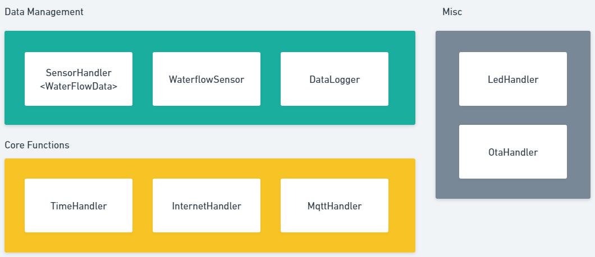

## Assumptions
- Internet connection will be available on first boot
- Internet connection may be lost along the life cycle, but is expected to return back
- NTP server for TimeHandler calibration is never down
- Flow sensor will never break

## Class Architecture
- "Data Management"
    - SensorHandler < WaterflowData >
    - WaterflowSensor : Sensor
    - Datalogger
        - publishQueue
        - waterflowDataFormatter : publishQueueFormatter
        - errorLog
- "Core Functions"
    - TimeHandler
    - InternetHandler
    - MqttHandler
- "Misc"
    - OtaHandler
    - LedHandler

## Datalogger Class
```
- createFile: "publishQueue.txt", "errorLog.txt"
    - file management: readAll, readLine, appendLine, deleteLine, deleteAllLines (debug)
- listDir
```



## WaterflowData Sequence Flow
- init (happens only when first boot or after restart)
    - wifi
        - HAS to be connected, else log error schedule restart
    - `TimeHandler`
        - calibrate `TimeHandler` using `configTime` until `timeSyncCallback`, else log error schedule restart
        - if `timesyncCallback` success, check latest stored data from `Datalogger`; if device timestamp from `getEpochTime()` > last timestamp `ts` in `Datalogger` then continue, else log error (device timestamp error) schedule restart
        - calls `configTime` in XX day intervals (default is never called again after called once in init)
- loop
    - `WaterflowSensor` object returns flowrate & volume
        - ticks every 1 sec, add up volume, tick resets to 0
    - `SensorHandler` temporary data holder 
        - acquires new data every 30 mins --> fills WaterflowData struct, acquire timestamp from `TimeHandler`
        - write to `Datalogger` before mqtt publish, reset volume to 0
        - check internet, mqtt publish (volume reset)
    - `Datalogger` permanent data holder (until explicitly deleted) 
        - delete when successful mqtt publish (flag as isPublished). retain at least 1 latest data for next `TimeHandler` check when esp just turned on, and doing `TimeHandler` calibration from ntp 
        - after internet reconnect and WaterflowData in Datalogger not empty, flush (mqtt publish) as seperate task until empty

## Data Format
- WaterflowData format:
```
struct WaterflowData {
    unsigned long timestamp;
    bool isPublished;
    float flowRate;
    float totalVolume;
};
```

- stored Datalogger format:
```
...
ts:<timestamp>,ispub:<isPublished>,fr:<flowRate>,vol:<volume>;
...
```

## Error Logging
- log all boot up of device
- log all restart behaviors
    - log forced restarts
    - log all restart reasons
- log all wifi connect disconnect
    - fail to connect to wifi
- log all TimeHandler calibration to ntp
- detect if TimeHandler error
    - fail to sync time with ntp
    - check by comparing current TimeHandler with last temporary data queue

---

## To Do:
- [x] refactor current code to run with basic function
- [ ] add internal/programatical TimeHandler
    - [x] create sample project: [esp-rtc-ntp](https://github.com/royyandzakiy/esp32-rtc-ntp)
    - [ ] redo TimeHandler using configTime to make more simple
    - [ ] do mandatory calibration to sever or ntp server when init; give option to do interval based calibration (default is never)
- [ ] local storage using SPIFFs to store unsent data
    - [ ] create sample project: TBD
    - [ ] having historical record of unsent data, including timestamp. create a temporary data queue
    - [ ] adding timestamp to each datapoint to be sent
    - [ ] after reconnection, will do flushing immidiately
    - [ ] retains last 5 datapoints for error checking purpose
- [ ] has an error log stored in spiffs